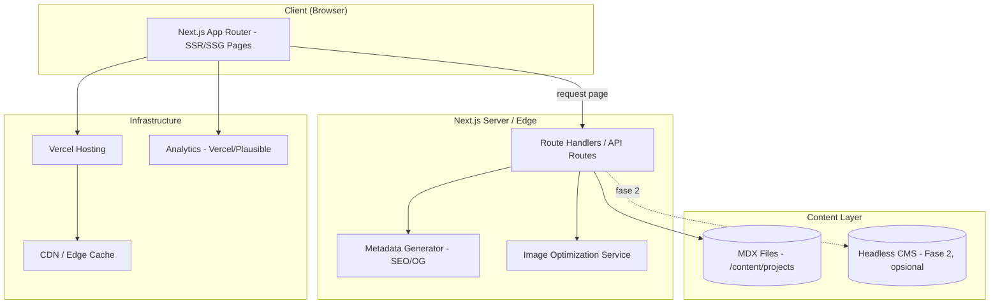
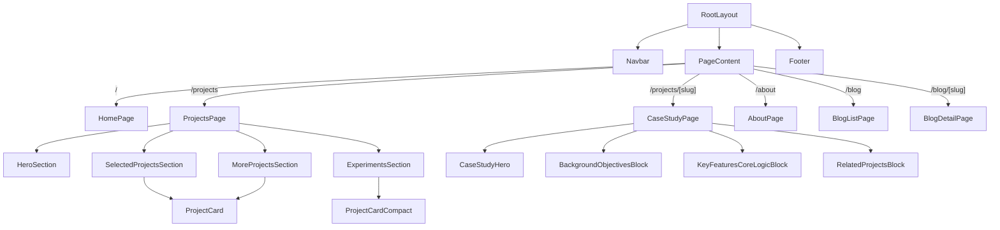
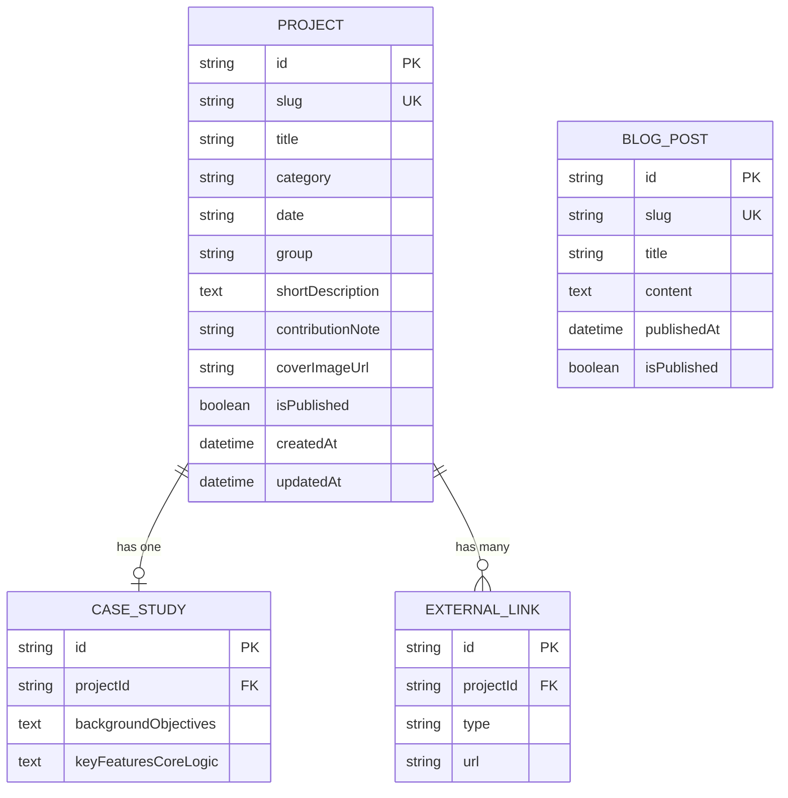
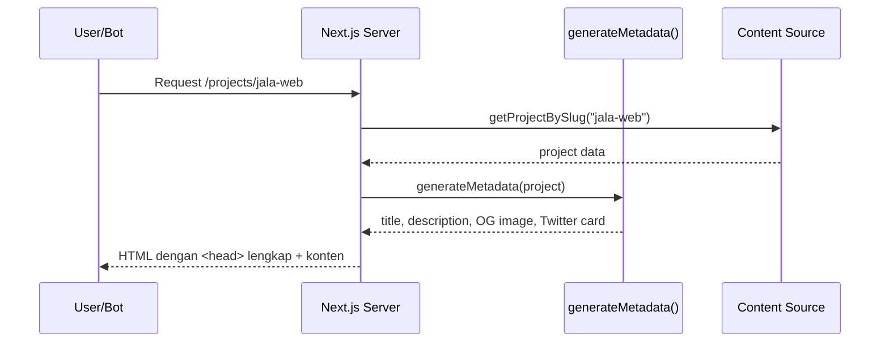
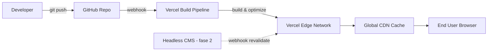

# Technical Blueprint
## Website Portofolio "Case Study Showcase" (Pelengkap PRD v1.0)

**Versi:** 1.0
**Tanggal:** 8 September 2026
**Dokumen terkait:** PRD-Portfolio-Case-Study-Website.md

---

## 1. Tujuan Dokumen
Blueprint ini menerjemahkan requirement di PRD menjadi rancangan teknis konkret: arsitektur sistem, skema database, struktur folder, spesifikasi API/route, dan alur deployment. Ditujukan untuk tim engineering yang akan mengimplementasikan.

---

## 2. Arsitektur Sistem (High-Level)



**Penjelasan alur:**
1. Browser meminta halaman (mis. `/projects` atau `/projects/[slug]`).
2. Next.js merender halaman secara SSG (Static Site Generation) saat build, atau ISR (Incremental Static Regeneration) untuk update konten tanpa full redeploy.
3. Data proyek diambil dari MDX file lokal (fase 1) atau headless CMS via API (fase 2).
4. Gambar diproses lewat Next.js Image Optimization sebelum dikirim ke client.
5. Metadata SEO/OG di-generate per halaman menggunakan Next.js Metadata API.
6. Hasil di-cache di CDN edge (Vercel) untuk performa global.

---

## 3. Component Diagram (Frontend)



---

## 4. Skema Database / Data Model (ERD)

> Fase 1: data berbasis file MDX (tidak butuh DB). Fase 2 (headless CMS/DB), skema berikut jadi acuan.



**Catatan skema:**
- `group` bertipe enum: `selected | more | experiment` — menentukan section penempatan di halaman `/projects`.
- `isPublished` memungkinkan draft proyek tidak tampil publik.
- `CASE_STUDY` dipisah dari `PROJECT` agar halaman listing tetap ringan (tidak perlu load konten panjang).

---

## 5. Struktur Folder (Next.js App Router)

```
project-root/
├── app/
│   ├── layout.tsx
│   ├── page.tsx                     # Home
│   ├── projects/
│   │   ├── page.tsx                 # /projects
│   │   └── [slug]/
│   │       └── page.tsx             # /projects/[slug]
│   ├── about/
│   │   └── page.tsx
│   └── blog/
│       ├── page.tsx
│       └── [slug]/page.tsx
├── components/
│   ├── layout/
│   │   ├── Navbar.tsx
│   │   └── Footer.tsx
│   ├── projects/
│   │   ├── ProjectCard.tsx
│   │   ├── ProjectCardCompact.tsx
│   │   └── CaseStudyLayout.tsx
│   └── shared/
│       └── SectionHeading.tsx
├── content/
│   └── projects/
│       ├── jala-web.mdx
│       ├── portal-pelindo.mdx
│       └── ...
├── lib/
│   ├── getProjects.ts               # fetch & sort/group logic
│   ├── getProjectBySlug.ts
│   └── generateMetadata.ts
├── public/
│   └── images/
├── types/
│   └── project.d.ts
├── next.config.js
└── tailwind.config.ts
```

---

## 6. Spesifikasi Route & Data Fetching

| Route | Rendering Mode | Data Source | Cache Strategy |
|---|---|---|---|
| `/` | SSG | Static config | Build-time |
| `/projects` | SSG + ISR | MDX/CMS, di-`group` & sort by `date` | Revalidate 1 jam (fase 2) |
| `/projects/[slug]` | SSG (`generateStaticParams`) | MDX/CMS by slug | Revalidate 1 jam |
| `/about` | SSG | Static config | Build-time |
| `/blog` | SSG + ISR | MDX/CMS | Revalidate 1 jam |
| `/blog/[slug]` | SSG | MDX/CMS by slug | Revalidate 1 jam |

**Logika grouping di `getProjects.ts` (pseudocode):**
```ts
function getGroupedProjects() {
  const all = getAllProjects().filter(p => p.isPublished);
  return {
    selected: all.filter(p => p.group === "selected").sort(byDateDesc),
    more: all.filter(p => p.group === "more").sort(byDateDesc),
    experiment: all.filter(p => p.group === "experiment").sort(byDateDesc),
  };
}
```

---

## 7. API/Route Handlers (jika Fase 2 pakai CMS eksternal)

| Endpoint | Method | Deskripsi |
|---|---|---|
| `/api/projects` | GET | List semua proyek published, support query `?group=selected` |
| `/api/projects/[slug]` | GET | Detail satu proyek + case study |
| `/api/revalidate` | POST | Webhook trigger ISR revalidation saat CMS update konten |

---

## 8. Metadata & SEO Generation Flow



---

## 9. Deployment Architecture



---

## 10. Non-Functional Implementation Notes

| Area | Implementasi Teknis |
|---|---|
| Performa | `next/image` untuk lazy-load & responsive srcset; font optimization via `next/font` |
| SEO | `generateMetadata()` per halaman; `sitemap.ts` & `robots.ts` otomatis dari App Router |
| Aksesibilitas | Semantic HTML (`<nav>`, `<main>`, `<article>`), alt text wajib di skema `PROJECT.coverImageUrl` |
| Keamanan | Tidak ada input publik selain `mailto:` link → minim attack surface di v1 |
| Monitoring | Vercel Analytics untuk Core Web Vitals real-user monitoring |

---

## 11. Perbedaan Cakupan dengan PRD

| Aspek | Ada di PRD | Ada di Blueprint |
|---|---|---|
| Tujuan bisnis & user flow | ✅ | ❌ (hanya referensi) |
| Metrik sukses produk | ✅ | ❌ |
| Diagram arsitektur & sequence | ❌ | ✅ |
| Skema database detail (tipe kolom, FK) | Sebagian (ringkas) | ✅ (lengkap) |
| Struktur folder kode | ❌ | ✅ |
| Spesifikasi endpoint API | ❌ | ✅ |
| Strategi caching/rendering | ❌ | ✅ |

---

## 12. Langkah Selanjutnya
1. Review blueprint ini dengan tim engineering untuk validasi kelayakan implementasi.
2. Setup repository sesuai struktur folder di atas.
3. Implementasi komponen dari `component diagram` secara bertahap sesuai roadmap PRD.
